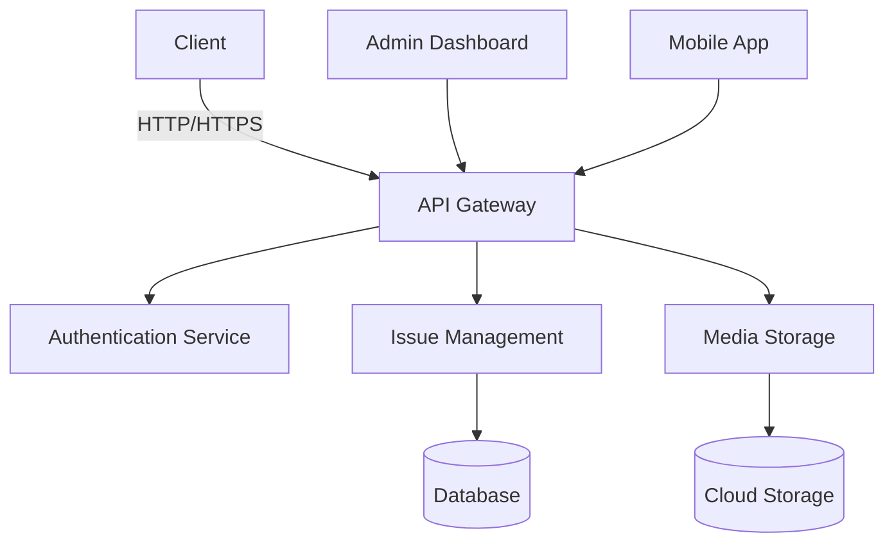

# 🏙️ CivicTrack: Empowering Communities, One Report at a Time

 *<!-- Add your banner image here -->*

[](https://opensource.org/licenses/MIT)
[](https://reactjs.org/)
[](https://www.typescriptlang.org/)
[](https://vitejs.dev/)

## 🏆 Hackathon Info
**Event:** Odoo x CGC Hackathon 2025  
**Theme:** Smart Cities & Civic Engagement  
**Duration:** 48 Hours  
**Team:** [Your Team Name]  

## ❓ Problem Statement
Modern cities face numerous civic challenges that often go unreported or unaddressed due to inefficient reporting mechanisms. Citizens need a simple, transparent way to report issues like potholes, broken streetlights, or garbage collection problems, while local authorities require a streamlined system to track and resolve these issues effectively.

## 💡 Our Solution
CivicTrack is a modern, user-friendly platform that bridges the gap between citizens and local authorities. Our solution enables:

- 📱 **Easy Issue Reporting**: Intuitive mobile-first interface for quick reporting
- 📍 **Location-Based Tracking**: Pinpoint issues precisely on an interactive map
- 📸 **Visual Documentation**: Support for multiple image uploads
- 🔍 **Transparent Tracking**: Real-time status updates on reported issues
- 🤝 **Community Engagement**: Upvote and comment on local issues
- 🏛️ **Government Integration**: Streamlined workflow for authorities

## 🏗️ System Architecture



## 🔄 Component Relationships

- **Frontend**: React + TypeScript + Vite
- **State Management**: React Context API
- **Styling**: Tailwind CSS
- **Authentication**: Clerk
- **Routing**: React Router
- **Form Handling**: React Hook Form
- **Maps Integration**: React Leaflet (planned)

## 🛠️ Technology Stack

### Frontend
- **Framework**: React 18.2
- **Language**: TypeScript 5.0
- **Build Tool**: Vite 4.4
- **Styling**: Tailwind CSS 3.3
- **State Management**: React Context API
- **Routing**: React Router 6.14
- **Form Handling**: React Hook Form 7.45
- **UI Components**: Headless UI, Heroicons

### Backend (Planned)
- **Runtime**: Node.js 18+
- **Framework**: Express.js
- **Database**: MongoDB / PostgreSQL
- **Authentication**: Clerk
- **Storage**: AWS S3 / Cloudinary
- **Maps**: Mapbox / Google Maps API

## 🚀 Getting Started

### Prerequisites
- Node.js 18+
- npm 9+
- Git

### Installation

1. **Clone the repository**
   ```bash
   git clone https://github.com/yourusername/civictrack.git
   cd CivicTrack
   ```

2. **Install dependencies**
   ```bash
   cd client
   npm install
   ```

3. **Set up environment variables**
   Create a `.env` file in the client directory:
   ```env
   VITE_APP_CLERK_PUBLISHABLE_KEY=your_clerk_publishable_key
   VITE_API_BASE_URL=http://localhost:3000/api
   ```

4. **Start the development server**
   ```bash
   npm run dev
   ```

5. **Open in your browser**
   The application will be available at `http://localhost:3000`

## 🌐 Deployment Links

- **Live Demo**: [Coming Soon]
- **Frontend**: [Netlify/Vercel Deployment]
- **Backend**: [Render/Railway Deployment]
- **API Documentation**: [Swagger/Postman]

## ✨ Key Features

### 🖥️ Dashboard
- View and filter reported issues
- Track issue status in real-time
- Interactive map view (coming soon)

### 📝 Report Issues
- Easy-to-use reporting form
- Multiple image uploads
- Automatic location detection
- Anonymous reporting option

### 🔍 Issue Details
- Comprehensive issue information
- Status history tracking
- Upvoting system
- Spam reporting

## 📸 Screenshots

| Dashboard | Report Issue | Issue Details |
|-----------|--------------|----------------|
|  |  |  |

## 🚀 Future Scope

- [ ] **Mobile App Development**
- [ ] **AI-Powered Issue Categorization**
- [ ] **Automated Status Updates via SMS/Email**
- [ ] **Gamification & Rewards System**
- [ ] **Advanced Analytics Dashboard**
- [ ] **Multi-language Support**

## 👥 Team Details

| Role | Name | Contact |
|------|------|---------|
| Frontend Developer | [Your Name] | [Your Email] |
| Backend Developer | [Team Member] | [Email] |
| UI/UX Designer | [Team Member] | [Email] |
| Project Manager | [Team Member] | [Email] |

## 🙏 Acknowledgements

- [Clerk](https://clerk.com/) for authentication
- [Tailwind CSS](https://tailwindcss.com/) for styling
- [React Icons](https://react-icons.github.io/react-icons/) for beautiful icons
- [Vite](https://vitejs.dev/) for the amazing development experience
- [Odoo x CGC Hackathon 2025](https://www.odoo.com/event/hackathon-2025) for this opportunity

## 📜 License

This project is licensed under the MIT License - see the [LICENSE](LICENSE) file for details.

---

<div align="center">
  Made with ❤️ for better communities | © 2025 CivicTrack
</div>
